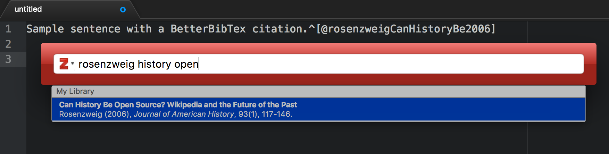

Zotero Markdown citations
=========

This package adds Zotero support to Atom Markdown editing. To use it, you will need to have the [Better BibTeX](http://zotplus.github.io/better-bibtex/index.html) plugin installed in Zotero.

## Visual picking of citations

If you don't feel like typing
citations out (and let's be honest, you don't), executing 'Zotero Citations: Pick' will call up a graphical picker which
will insert these for you, formatted and all. You can set what style you want your picked citations to be returned in in
the preferences

- Atom for Mac: Toggle the Command Palette (command-shift-P, or select it in Packages menu), and scroll down to select 'Zotero Citations: Pick'
- Atom for Linux: Toggle the Command Palette (cntrl-shift-P), and scroll down to select 'Zotero Citations: Pick'

**IMPORTANT**: Zotero, with Better BibTeX installed, must be running while you use these.

You can also use the picker for MultiMarkdown or Pandoc citations; you can choose between the desired format in the package config.

